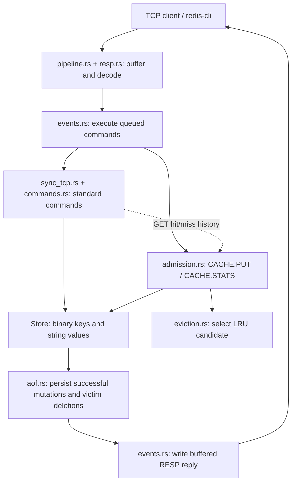

# Vynk

**The Redis idea, rewritten.**

Vynk is a Redis implementation with extra features, written from scratch in Rust. It includes TCP event handling, RESP, string storage, expiry, approximate LRU eviction, append-only persistence, and TinyLFU-style cache admission. It implements a subset of Redis commands plus `CACHE.PUT` and `CACHE.STATS` extensions.

This is not a wrapper around an existing Redis client library. Every layer — the network event loop, the protocol parser, the command dispatcher, the storage engine, and the persistence format — is implemented directly.

## Table of contents

- [What this is, in plain terms](#what-this-is-in-plain-terms)
- [Quick start](#quick-start)
- [Supported commands](#supported-commands)
- [Architecture overview](#architecture-overview)
- [How a request flows through the system](#how-a-request-flows-through-the-system)
- [The RESP protocol](#the-resp-protocol)
- [Storage and value encoding](#storage-and-value-encoding)
- [Expiry and eviction](#expiry-and-eviction)
- [Cache admission](#cache-admission)
- [Persistence (AOF)](#persistence-aof)
- [Project layout](#project-layout)
- [Testing](#testing)
- [Known limitations](#known-limitations)
- [Roadmap](#roadmap)

## What this is, in plain terms

Redis is a database that keeps all of its data in memory instead of on disk, which is what makes it extremely fast. It is normally used as a cache or a fast lookup store sitting in front of a slower, primary database.

This project reimplements the core of that idea in Rust:

- A server that many clients can talk to at once, without spawning a thread per client.
- A parser for RESP command arrays, preserving binary keys and values.
- A key-value store held in memory, with support for values that expire automatically.
- Expiration sweeps and capacity eviction within the event loop, with a configurable key-count limit.
- Optional admission control that compares incoming keys with eviction candidates using recent read frequency.
- An append-only log for restart recovery, with periodic disk synchronization.

It is compatible enough with the real Redis wire protocol that it can be driven directly with `redis-cli`, the standard Redis command-line client.

## Quick start

Requires a Rust toolchain supporting edition 2024 (install via [rustup.rs](https://rustup.rs) if needed). Install `redis-cli` separately to use the examples.

Install the published crate:

```sh
cargo install vynk --locked
vynk
```

Or run it from source:

```sh
git clone https://github.com/pratham-srivastava-07/vynk.git
cd vynk
cargo run
```

The server listens on `127.0.0.1:7379`. In a second terminal, connect with `redis-cli`:

```sh
redis-cli -p 7379

127.0.0.1:7379> ping
PONG
127.0.0.1:7379> set greeting "hello world"
OK
127.0.0.1:7379> get greeting
"hello world"
127.0.0.1:7379> set session:token abc123 EX 60
OK
127.0.0.1:7379> ttl session:token
(integer) 60
127.0.0.1:7379> incr visits
(integer) 1
127.0.0.1:7379> object encoding visits
"int"
127.0.0.1:7379> del greeting
(integer) 1
127.0.0.1:7379> cache.put product:42 "Laptop" EX 60
STORED
127.0.0.1:7379> get product:42
"Laptop"
127.0.0.1:7379> cache.stats
# Returns cache metrics as a RESP bulk string.
```

The example assumes free capacity. At capacity, `CACHE.PUT` may return `REJECTED`. Data is stored in `appendonly.aof` in the directory where the server runs; restarting from that directory reloads it.

## Supported commands

| Command | Behavior |
|---|---|
| `PING` | Replies `PONG`. |
| `PING <message>` | Echoes `<message>` back. |
| `SET key value` | Stores a string value. |
| `SET key value EX <seconds>` | Stores a value with a relative expiry, in seconds. |
| `SET key value PX <ms>` | Stores a value with a relative expiry, in milliseconds. |
| `SET key value PXAT <ms>` | Stores a value with an absolute expiry (Unix time in milliseconds). |
| `CACHE.PUT key value [EX seconds / PX ms / PXAT ms]` | Applies admission control; replies `STORED` or `REJECTED`. |
| `CACHE.STATS` | Reports read hits/misses, admission decisions, replacement count, aging resets, and admission metadata bytes. |
| `GET key` | Returns the value, or a nil reply if the key does not exist or has expired. |
| `INCR key` | Parses the value as an integer, adds one, stores and returns the result. Missing keys become 1. |
| `DEL key [key ...]` | Deletes one or more keys, returns the count actually removed. |
| `EXPIRE key seconds` | Sets a relative expiry on an existing key. |
| `TTL key` | Returns seconds remaining (`-1` if the key has no expiry, `-2` if it does not exist). |
| `OBJECT ENCODING key` | Reports how a string value is internally represented: `int`, `embstr`, or `raw`. |
| `INFO` / `INFO KEYSPACE` | Returns a RESP bulk string containing live key counts, expiring key counts, and average TTL in milliseconds. |

Unknown command names return `-ERR unknown command`. Unsupported options and subcommands return RESP errors. `CACHE.PUT` and `CACHE.STATS` are project-specific RESP commands, not standard Redis commands.

Commands validate argument counts before changing data. `SET EX/PX` requires a positive duration; plain `SET` clears an existing TTL. `EXPIRE` returns `0` for missing or expired keys, and deletes a live key immediately for zero or negative durations. `INCR` preserves TTL and rejects invalid integers or overflow without changing the value. Options such as `NX`, `XX`, and `KEEPTTL` are not implemented.

## Architecture overview



Both write paths use the same store and AOF. The event loop also runs expiration sweeps and periodic AOF synchronization. `CACHE.PUT` makes its admission decision before changing live values; ordinary `SET` uses the existing capacity policy.

## How a request flows through the system

1. **Accept.** The event loop (`events.rs`) is registered with the OS for readiness notifications on the listening socket. When a client connects, it is registered for its own notifications and tracked in a client table.
2. **Read.** When a client's socket becomes readable, its bytes are read into a per-client buffer (`pipeline.rs`). Because the socket is non-blocking, a read can return "no more data right now" without blocking the whole server — the event loop simply moves on to the next ready client.
3. **Parse.** The buffer is scanned for complete RESP command frames. A client can send several commands back to back (pipelining) before waiting for replies; each complete frame becomes a queued command, and any trailing partial frame is left in the buffer until more bytes arrive, even if a single command's data is split across multiple TCP reads.
4. **Execute.** The event loop routes standard commands through `sync_tcp.rs` to `commands.rs`. It routes `CACHE.PUT` and `CACHE.STATS` to `admission.rs`. Successful GET processing records a hit or miss in the frequency history; CACHE.PUT validates its arguments and compares frequencies when a new key needs a victim.
5. **Persist.** If the command changed data, the resulting state is appended to the on-disk log (`aof.rs`) before the loop continues.
6. **Reply.** The response is encoded in RESP and queued for writing. If the socket cannot accept all the bytes immediately, the event loop switches that client to "waiting to write" and resumes once the socket is ready again, so one slow client cannot stall the others.
7. **Background sweep.** On a roughly 100ms timer, the event loop removes expired keys and synchronizes the log to disk. Capacity enforcement runs after command execution and startup replay. These operations share the event loop, so heavy work can delay the timer.

All of this runs on a single OS thread. Concurrency comes from the event loop interleaving clients' I/O. Command execution, sampling, and disk synchronization share that thread and can delay other clients.

## The RESP protocol

The server supports RESP2 command arrays and replies. Headers use textual lengths and delimiters; bulk strings can contain arbitrary bytes, including nulls, CRLF, and non-UTF-8 data. The supported type markers are:

| Byte | Type | Example on the wire |
|---|---|---|
| `+` | Simple string | `+OK\r\n` |
| `-` | Error | `-ERR unknown command\r\n` |
| `:` | Integer | `:42\r\n` |
| `$` | Bulk string | `$5\r\nhello\r\n` |
| `*` | Array | `*1\r\n$4\r\nPING\r\n` |

This server requires commands as arrays of bulk strings; inline commands and RESP3 are not implemented. For example, `SET key value` arrives on the wire as:

```
*3\r\n$3\r\nSET\r\n$3\r\nkey\r\n$5\r\nvalue\r\n
```

The decoder validates CRLF framing, checked lengths, array size, and nesting depth. Client input buffers are capped at 64 MiB, arrays at 1,024 elements, and nesting at 32 levels. Command frames must contain non-null bulk strings. Malformed input closes that connection; incomplete frames wait for more bytes. These are per-connection limits, not a global memory budget.

## Storage and value encoding

Internally, every stored value is one of three representations, chosen automatically based on the value's content and size:

- **Int** — the value parses cleanly as an integer, and is stored as one. This makes `INCR` cheap and exact.
- **EmbStr** ("embedded string") — a short string (44 bytes or fewer), stored compactly.
- **Raw** — anything longer, stored as a plain byte buffer.

`OBJECT ENCODING <key>` reports the representation. The names model Redis encodings; `EmbStr` uses a Rust boxed byte slice, not Redis's combined object/string allocation. Every entry also carries an optional expiry deadline and a last-access clock used for eviction.

## Expiry and eviction

Two independent mechanisms keep the store from accumulating stale or excess data:

**Expiration.** Commands remove expired keys when accessing them. The periodic sweep first traverses the store to collect keys with a TTL, then samples batches of up to 20. It continues while more than 25% of a batch is expired. Candidate collection still costs a full map traversal.

**Approximate LRU eviction.** The current defaults in `src/config.rs` allow 100 keys and evict a batch of 40 when capacity is crossed: 101 live keys become 61. Expired keys are reclaimed first. Each victim selection samples up to five keys and updates a persistent pool of 16 candidates, ordered by idle time. The most idle candidate is removed. Sampling currently traverses the HashMap, so eviction cost grows with the dataset.

Idle time uses a wrapping 24-bit clock measured in seconds. The clock is stored in a `u32`; masking it to 24 bits does not reduce this field's allocation to three bytes. This policy uses key count, not a byte-based memory budget, and admits every valid `SET`.

### Cache admission

`CACHE.PUT` adds TinyLFU-style admission in front of the existing LRU pool. Normal `SET` retains its existing behavior. Applications read with `GET`, fetch from their backend on a miss, then attempt `CACHE.PUT`. A `REJECTED` reply means the application should use its fetched value without caching it.

```text
GET product:42
(nil)
# Application fetches the value from its backend.
CACHE.PUT product:42 "product data" EX 60
STORED
CACHE.STATS
```

- Every valid `GET` records demand, including misses. Writes and invalid requests do not count as reads; a miss followed by a fill counts once.
- New keys use free capacity first. At capacity, the candidate must have a strictly higher estimated frequency than the victim selected by the LRU pool. Ties preserve the resident key. Acceptance replaces one key, rather than triggering the normal SET batch eviction.
- Existing keys can be overwritten without a frequency comparison. Expired entries are reclaimed before choosing a live victim. Expiry options and validation reuse SET semantics.
- Use `CACHE.PUT` for fills that may be declined. Using ordinary `SET` after a miss bypasses admission. With no prior GET history, a new key and a resident key can both have frequency zero; their tie rejects the new key when full.
- Frequency history uses four rows of 1,024 saturating `u16` counters and an 8,192-bit Bloom doorkeeper. A first observation sets doorkeeper bits; subsequent observations increment the sketch. At 1,000 samples, counters and sample count halve and the doorkeeper clears. Hash collisions can overestimate demand.
- The sketch and doorkeeper use 9 KiB, plus small fixed state. `admission_metadata_bytes` includes that state but excludes allocator overhead, stored data, and the existing LRU pool. `admission_evictions` counts only replacements caused by CACHE.PUT, not SET eviction or expiration.
- Accepted values, TTLs, and victim deletions use the existing AOF path. Rejected fills add no AOF records. Frequency history and metrics restart empty; replay does not rerun admission decisions.

This follows the admission approach in [TinyLFU](https://arxiv.org/abs/1512.00727), with a count-min sketch and doorkeeper. It is not W-TinyLFU: there is no recency window. New short bursts can be rejected, and no general hit-rate or throughput advantage over Redis has been benchmarked. Memory budgeting and faster sampling remain separate work.

`CACHE.STATS` takes no arguments and returns these fields in a RESP bulk string:

| Field | Meaning |
| --- | --- |
| `hits` | Successful GET requests that found a live value, including values written by SET. |
| `misses` | Successful GET requests that found no live value. |
| `admitted` | Accepted CACHE.PUT calls, including overwrites; not the number of currently stored keys. |
| `rejected` | Valid CACHE.PUT calls declined by admission; validation errors are excluded. |
| `admission_evictions` | Live victims removed to accept a CACHE.PUT. |
| `frequency_resets` | Frequency-aging passes since startup. |
| `admission_metadata_bytes` | Fixed admission state plus allocated counter and doorkeeper storage. |

These counters cover the current server process. There is no metrics reset command or per-key decision history yet. Backend fetches are performed by the application, so `misses` does not directly measure database queries.

## Persistence (AOF)

The server keeps `appendonly.aof` in its working directory. Successful mutations are appended before replying, then synchronized with `sync_all` on the periodic sweep. A reply does not mean the write has already reached durable storage; recent acknowledged writes can be lost on power failure. Instead of logging commands verbatim, mutations are normalized before being written:

- `INCR` is logged as the resulting `SET`, so replaying the log does not depend on re-running the arithmetic.
- Expiring keys are logged with an **absolute** expiry timestamp (not "expires in N seconds from now"), so replay produces the same expiry moment regardless of when the log is replayed.
- Deletions and keys that have already expired at write time are logged as `DEL`.

On startup, the log is replayed from the beginning to rebuild the in-memory store. If the process was killed mid-write and the log's last entry is incomplete, that trailing partial entry is discarded rather than treated as corruption, and the server starts up cleanly from everything before it.

Malformed complete entries cause startup to fail without truncation. Append or synchronization errors stop the server instead of being silently ignored. Disk-full and power-loss behavior have not been fault-injection tested. Older logs cannot recover writes or expiry information that previous versions never recorded.

## Project layout

```
src/
├── main.rs              Entry point — starts the event loop.
├── events.rs             The event loop itself: accept, read, dispatch, write, background sweep.
├── pipeline.rs           Buffers incoming bytes per client and splits them into complete commands.
├── resp.rs                Top-level helper: decode a RESP frame into command tokens.
├── helpers/
│   ├── utils.rs           Core RESP decoder: type-byte dispatch, line/length reading, limits.
│   ├── data_parse.rs      Per-type decoders (simple string, error, integer, bulk string, array).
│   └── port.rs             Server bind address.
├── cmd.rs                 RedisCmd (parsed command) and the Store type alias.
├── sync_tcp.rs            Dispatches a parsed command to its implementation by name.
├── commands.rs            Standard string, expiry, and inspection commands.
├── admission.rs           Frequency sketch, doorkeeper, admission decisions, and CACHE.STATS.
├── admission/tests.rs     Unit tests for frequency aging and admission behavior.
├── object.rs               The stored value type (Obj) and its encodings (Int / EmbStr / Raw).
├── types_encoding.rs       Encoding tag constants and integer parsing rules.
├── eviction.rs              Expired-key sweep and approximate LRU eviction.
├── aof.rs                    Append-only file: write, flush, and replay-on-startup.
├── stats.rs                  Keyspace statistics used by INFO KEYSPACE.
├── config.rs                  Tunable constants (eviction ratio, max key limit).
└── client.rs                  An earlier, single-client blocking prototype, kept for reference.

tests/
├── feature_audit.rs      End-to-end integration tests: spins up a real server and drives it
│                          over a socket, covering commands, edge cases, and malformed input.
├── admission/mod.rs        Admission TCP and restart tests, included by feature_audit.rs.
└── support/                Test harness (a minimal RESP client used only by the tests).
```

## Testing

```sh
cargo test -- --test-threads=1
cargo test --release -- --test-threads=1
```

Tests exist at two levels:

- **Unit tests**, alongside the modules they cover (for example `src/commands/tests.rs`, `src/eviction/tests.rs`), exercising individual functions directly.
- **Integration tests** (`tests/feature_audit.rs`) that start a real server on a real socket and drive it exactly as a client would — covering command arity errors, TTL edge cases, unicode keys, pipelined and split-across-packets commands, and oversized or malformed frames that should be rejected safely rather than crash the server.

Keep port 7379 free. Integration tests serialize their isolated server processes and use temporary directories for persistence; they do not use the repository's AOF. Coverage also includes binary data across restart, expiry during downtime, rejected writes, concurrent increments, slow readers, half-closed sockets, truncated AOF recovery, and eviction replay. A unit test forces partial writes followed by `WouldBlock` to check output resumption.

Verified on Windows on 2026-09-15: **23 unit tests and 54 integration tests pass in both debug and release**, with no failures or ignored tests. Admission tests cover scan rejection, repeated misses, aging, ties, overwrite validation, expired capacity, binary data, unchanged AOF on rejection, and persisted replacement. These checks cover the implemented subset, not full Redis compatibility.

## Known limitations

- Single-threaded: command execution and disk synchronization can delay replies to other clients.
- Only string values are supported. Lists, sets, and hashes are represented in the codebase (`ObjValue::_List`, `_Set`, `_Hash`) but not yet wired up to any commands.
- No replication, clustering, pub/sub, transactions, or Lua scripting.
- The append-only file is not compacted — it grows with every write and is never rewritten into a compact snapshot.
- `INFO` only implements the `KEYSPACE` section.
- No authentication or TLS; the server binds to localhost.
- Fixed key-count capacity and per-connection input limits do not bound total process memory. AOF replay currently reads the entire log into memory.
- No Redis differential testing, fuzzing, or measured performance advantage is claimed. See [the feature audit](feature-audit.md) for regression results and remaining verification gaps.

## Roadmap

- Byte-based memory accounting, including policy metadata.
- Faster key sampling and smaller capacity-eviction batches.
- Reproducible admission-versus-LRU benchmarks: scan traffic, changing popularity, uniform requests, and short bursts.
- Bounded per-key admission explanations.
- Wire up `LPUSH`/`RPUSH`/list commands using the existing `_List` variant.
- Wire up hash commands (`HSET`/`HGET`/etc.) using the existing `_Hash` variant.
- Wire up set commands using the existing `_Set` variant.
- AOF compaction / rewrite.
- Additional `INFO` sections (memory, server, stats).
